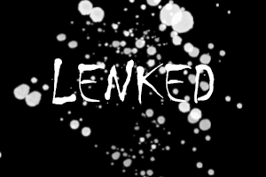

<!--
<h1 align="center">Hi 👋, I'm Evrard Ntanguen(Lenked)</h1>

-->
<!--
**Lenked/Lenked** is a ✨ _special_ ✨ repository because its `README.md` (this file) appears on your GitHub profile.

Here are some ideas to get you started:

- 🔭 I’m currently working on to the web, mobile and artificial intelligence
- 🌱 I’m currently learning python, kotlin and Node .js
- 👯 I’m looking to collaborate on on informative projects
- 🤔 I’m looking for help with ...
- 💬 Ask me about ...
- 📫 How to reach me: lenked43@gmail.com
- 😄 Pronouns: ...
- ⚡ Fun fact: ...
-->

<!-- - 🔭 I’m currently working on to the web, mobile and artificial intelligence
- 🌱 I’m currently learning python, kotlin and Node .js
- 👯 I’m looking to collaborate on on informative projects
- 📫 How to reach me: lenked43@gmail.com

<h3 align="center">A passionate fullstack junior Web & MOBILE developer</h3>
-->

# Lenked - Développeur d'Applications

## À propos de moi
Je suis Lenked, un passionné de développement d'applications web et mobiles. Mon objectif est de créer des solutions innovantes et de contribuer à des projets inspirants. 

## Compétences
- **Langages de programmation:** Python, JavaScript, C#
- **Langages web:** HTML, CSS, JavaScript
- **Langages mobiles:** Kotlin, Java, React Native, Flutter, Xamarin
- **Frameworks et bibliothèques:** React, Vite
- **Base de données:** MySQL, Oracle, SQLite, MongoDB
- **Gestion de versions:** Git, GitHub
- **Déploiement et hébergement:** AWS, Heroku, Firebase
- **Outils de développement:** PyCharm, Android Studio, Visual Studio Code

## Portfolio en ligne
Découvrez mes projets sur [GitHub](https://github.com/lenked43).

## Contact
- 📧 Email: ntanguenevrard05@gmail.com
- 🌐 LinkedIn: [lenked43](https://www.linkedin.com/in/lenked43/)
- 🐦 Twitter: [@lenked43](https://twitter.com/lenked43)

## Centres d'intérêt
- ⚽ Football & 🏀 Basket
- 📚 Lecture
